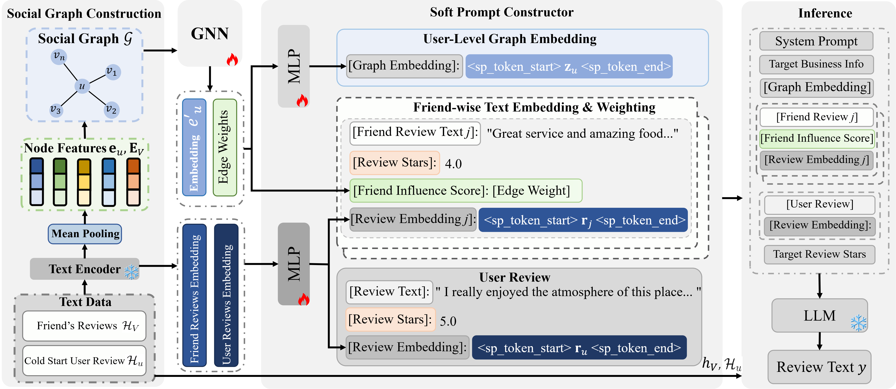

# Enhancing Cold-Start Personalization for Large Language Models with Social Information

## Overview



## Setup

This code has been tested on Ubuntu 20.04 with Python 3.8 or above.

We recommend using [Miniconda](https://docs.conda.io/en/latest/miniconda.html) and setting up an environment:

```bash
conda create -y --name soper python=3.8
conda activate soper
```

Then install the required packages:

```bash
pip install -r requirements.txt
```

This will automatically setup all dependencies.

## Datasets

We use the Yelp dataset as our primary benchmark. To prepare the data for training and evaluation, please follow the preprocessing pipeline described below. 

> **Note:** Please ensure all scripts are executed from the project root and update the local file paths within the scripts to match your environment.

### 1. Data Preprocessing Pipeline

Follow these steps in order to generate the required datasets:

1. **Filter Dataset**: Screen the raw Yelp dataset based on cold-start constraints (e.g., minimum record requirements).
   ```bash
   python SoPer-main/filter_data/filter_yelp.py
2. **Encode Reviews**: Generate embeddings for the filtered review text using the pre-trained encoder.
   ```bash
   python SoPer-main/embed_yelp_reviews.py
3. **Create Splits**: Partition the encoded data into training, validation, and testing sets.
   ```bash
   python SoPer-main/filter_data/creat_train_test.py
4. **Final Dataset Generation**: Construct the final processed pre-training datasets used by the model.
   ```bash
   python SoPer-main/creat_datasets.py
### 2. Directory Structure

After completing the pipeline, the data directory will be organized as follows:

```
data
  ├── processed_test
  ├── processed_train
  └── yelp_tokenizer
```

## Usage

```bash
export PYTHONPATH=$(pwd)
python FORCE_TORCHRUN=1 deepspeed train.py
```


